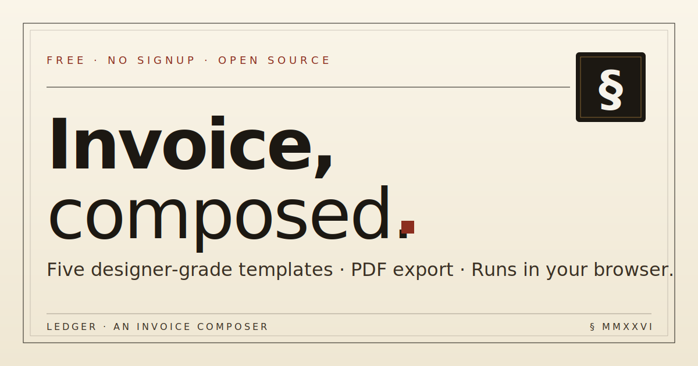

# Ledger — Free Invoice Generator

> A browser-only invoice composer with typographic templates, deep theme controls, and vector PDF export.

Ledger is a free, no-signup, open-source invoice generator built for people who care what a document looks like. It runs entirely in the browser: no backend, no tracking, no uploads, no account wall.

**Live:** https://spacingmind.github.io/ledger-invoice-generator/



## Highlights

- **12 designed invoice templates**: Classic, Ledger, Bauhaus, Gazette, Mono, Linen, Marine, Carbon, Riso, Noir, Botanica, Atomic.
- **Deep visual control**: paper, ink, accent, fonts, display weight, italic, spacing, density, rules, total bar, radius.
- **Local-first by design**: invoice data and theme choices stay in the browser.
- **Vector PDF output**: uses native browser print for sharp, searchable PDFs.
- **Logo upload**: drag and drop with multiple layout positions and sizing controls.
- **12 currencies**: USD, EUR, GBP, JPY, CNY, VND, AUD, CAD, CHF, SGD, INR, KRW.
- **Responsive editor**: desktop three-column workspace, tablet/mobile drawer, phone bottom sheet.
- **No framework**: plain TypeScript, CSS, and ESM modules.

## Why It Exists

Most invoice generators treat templates like spreadsheet skins. Ledger treats invoices as designed documents.

Each preset has its own typographic direction, then every important design token remains editable. The result is still fast and practical: open the app, fill the form, pick a look, export a PDF.

## What Makes It Different

**Document-first UI**  
The preview is the center of the product. Controls exist to shape the invoice, not to turn the app into a dashboard.

**Real PDF fidelity**  
Ledger uses `window.print()` instead of screenshot-based PDF generation. That keeps text selectable, searchable, and crisp.

**Privacy by default**  
There is no backend service. Form data is stored in `localStorage`; generated PDFs are produced locally by the browser.

**Open-source license**  
Ledger is released under AGPL-3.0, including the network-service source-sharing requirement for modified hosted versions.

## Tech Stack

- TypeScript compiled with `tsc`
- CSS modules by convention with `@import` partials
- Native DOM APIs and `EventTarget` models
- Static hosting through GitHub Pages or any static host
- `live-server` for local development

## Repository Shape

```text
src/
├─ main.ts
├─ styles.css
├─ tokens.css
├─ fonts.css
├─ landing.css
├─ print.css
├─ models/
│  ├─ invoiceModel.ts
│  ├─ themeModel.ts
│  ├─ theme.ts
│  ├─ currency.ts
│  └─ format.ts
├─ controllers/
│  ├─ appController.ts
│  └─ pdfController.ts
└─ views/
   ├─ header/
   ├─ drawer/
   ├─ preview/
   ├─ invoice/
   ├─ composeTab/
   ├─ themeTab/
   └─ exportTab/
```

Views are grouped by feature. Most view folders keep three files together: behavior (`*.ts`), markup (`*.html.ts`), and styles (`*.css`).

## Run Locally

```bash
npm install
npm run watch
npm run serve
```

Open:

- http://localhost:5173 for the landing page
- http://localhost:5173/app.html for the editor

## Build

```bash
npm run build
```

The compiled `dist/` directory is committed so the project can be served directly as a static site.

## Roadmap

- [ ] Multi-page invoices for long line item lists
- [ ] CSV import for line items
- [ ] Tax, discount, and shipping line toggles
- [ ] Multi-language UI
- [ ] Shareable themes through URL params

## Contributing

Issues and PRs are welcome. For larger changes, open an issue first so the implementation can stay aligned with the product direction and typographic system.

## License

[GNU Affero General Public License v3.0](LICENSE) (AGPL-3.0-only).

Ledger is free and open-source software. You can use, study, modify, and redistribute it under the AGPL-3.0. If you modify Ledger and run it as a network service, the AGPL requires you to offer the corresponding source code of your modified version to users of that service.
